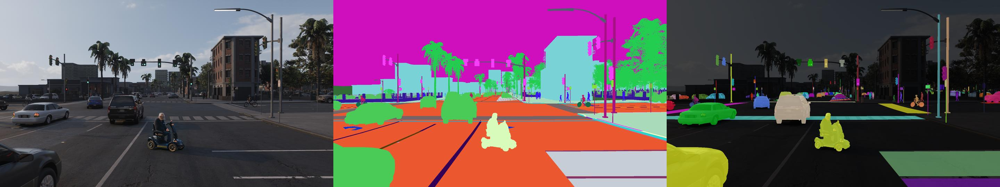
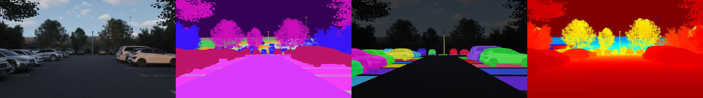

# Data Lab Educational Notebooks

### Code tutorials covering all things Data Lab

*Example Reactor Output*
  

---

## Take the Guided Tour

If you're brand new to data lab, diving head first into some of these tutorials might be too much at once, as they may assume you have prior knowledge of Data Lab tools. For this reason, we offer a guided tour of selected tutorials which build on concepts in a structured way, starting simple and working up to more complex usage, establishing generally useful Data Lab skills while giving a high level view of the wide variety of supported use cases.

First, we review the process of configuring and rendering a basic driving scenario, which establishes the general structure of all Data Lab scripts. Then, we explore changing the environment and generator parameters to change the nature of the scene as we create parking and debris scenarios. Next, we get our first experience with custom simulation agents, placing a geometric primitive into the scene and inpainting it using Reactor's generative AI. After this, we cover making data for pedestrian edge cases, lane line detection, and road sign classification. We close out the land-based demonstrations with a case study on improving stroller detection using Reactor and some advanced simulation tricks.

Next, we take to the skies in drone scenes by taking simulation control of the ego agent. First we look at simulating the ego with a stored flight path, which may be obtained from real drone flight logs. Then, we interpolate between two points to generate a custom flight path, and relate this path to another airborne object to the scene.
  

*Example Parking Scene*

### Outline

1. [Data Lab Overview](general_use/data_lab_overview/data_lab_overview.ipynb)
    - In this notebook we familiarize ourselves with the anatomy of a Data Lab script by generating a basic driving scenario.
2. [Parking scene](parking/parking_overview/parking_overview.ipynb)
    - This notebook explores modifying agent and environment parameters to create parking scenes with a variety of parking space styles.
3. [Debris](road_debris/debris/debris.ipynb)
    - We gain experience querying the asset library for interesting objects and scattering them in the scene using a debris generator.
4. [Intro to Reactor](reactor/introduction/introduction.ipynb)
    - We get our first glimpse at placing custom simulation agents, placing a geometric primitive in the scene and inpainting it using textual prompts and Reactor
5. [Pedestrian Behaviors](pedestrians/pedestrians_around_ego/pedestrians_around_ego.ipynb)
    - We explore the possibilities of pedestrian control and the edge cases they can generate data for.
6. [Lane Lines](lane_lines/lane_lines_2d/lane_lines_2d.ipynb)
    - We learn how to load map data and combine it with rendered frames to create lane line annotations.
7. [Road Signs](road_signs/road_signs/road_signs.ipynb)
    - In this notebook we write functions to populate our environment with abundant road sign training examples.
8. [Reactor Stroller Experiment](reactor/stroller_experiment/stroller_experiment.ipynb)
    - We enact interdependent multi-object animation to place pedestrians behind strollers, and review training results achieved using a scaled output batch.
9. [Drone scene from flight log](drones/drone_scene_from_flight_log/drone_scene_from_flight_log.ipynb)
    - Takes an existing flight log and generate an airborne Data Lab scene.
10. [Airborne Object Tracking](drones/airborne_object_tracking/airborne_object_tracking.ipynb)
    - Jointly simulate an ego and another airborne object to create object tracking data.
